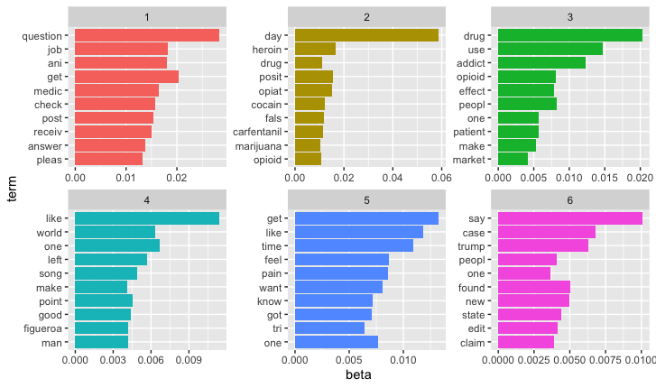

Brief Introduction - LDA
----------------
LDA stands for Latent Dirichelet Allocation. LDA topic modeling is a computational text analysis method used to find “latent” thematic structure of a given textual dataset.

Preparation - Install packages
----------------
<pre class="r"><code>library(quanteda)
library(topicmodels)
library(ldatuning)
library(dplyr)
library(tidytext)
library(tidyverse)
library(ggplot2)
library(rmarkdown)
library(ggthemes)
library(scales)</code></pre>

Import Data
----------------
<pre class="r"><code>df <- read.csv("reddit_post.csv", header = TRUE, sep = ",")

df$fulltext <- as.character(df$fulltext)
df$subreddit <- as.character(df$subreddit)

df_corpus <- corpus(df$fulltext)(df$fulltext)</code></pre>

Pre-process-remove stopwords, stemming
----------------
<pre class="r"><code>token = tokens(df_corpus,remove_punct = TRUE,remove_symbols = TRUE,remove_numbers = TRUE)

df_dfm_raw <- dfm(token)
stem = dfm_wordstem(df_dfm_raw)

stopword_cust = c(stopwords("en"), "also", "can","amp", "now","back","just","need","becaus","befor","first","year","#10003","#x200b","around","away","didn","etc","even","everyon","fuck","includ","may","month","next","part","right","still","til","titl","vudu","well","whi","you'r","i'v","1-2")
df_dfm_cust = dfm_remove(stem, stopword_cust,min_nchar = 3) # customize stopwords</code></pre>

Decide the number of topics (K)
----------------
<pre class="r"><code>result <- FindTopicsNumber(df_dfm_cust, 
                           topics = seq(from = 10, to = 20, by = 1),
                           metrics = c("Griffiths2004", 
                                       "CaoJuan2009", "Arun2010", 
                                       "Deveaud2014"),
                           method = "Gibbs", 
                           control = list(seed = 123), 
                           mc.cores = 2L, 
                           verbose = TRUE)</code></pre>

Run LDA topic modeling
----------------
<pre class="r"><code>k <- 6 # Number of topics
control_LDA_cust_slct <- list(alpha = 50/k, estimate.beta = TRUE, 
                              verbose = 0, prefix = tempfile(), 
                              save = 0, keep = 0, 
                              seed = 123, nstart = 1, 
                              best = TRUE, delta = 0.1, iter = 2000, 
                              burnin = 100, thin = 2000)
lda_cust_slct = LDA(df_dfm_cust, k = k, method = "Gibbs", 
                    control = control_LDA_cust_slct)

topics_cust_slct = terms(lda_cust_slct, 30)
write.csv(topics_cust_slct,"topics_reddits.csv")#output topics</code></pre>

Visualization
----------------
<pre class="r"><code>topics<- tidy(lda_cust_slct, matrix="beta")
top_terms <- topics %>% group_by(topic) %>%
  top_n(10, beta) %>%
  ungroup() %>%
  arrange(topic, -beta)

top_terms %>% mutate(term = reorder(term, beta)) %>%
  ggplot(aes(term, beta, fill = factor(topic))) +
  geom_col(show.legend = FALSE) +
  facet_wrap(~ topic, scales = "free") +
  coord_flip()</code></pre>
  

